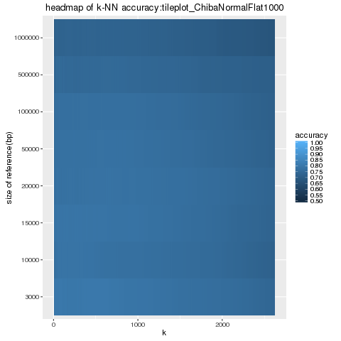
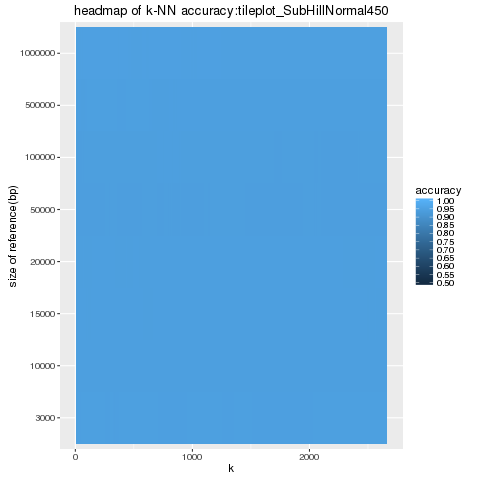
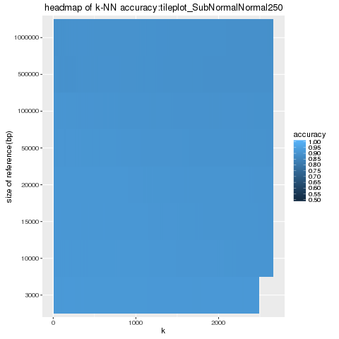
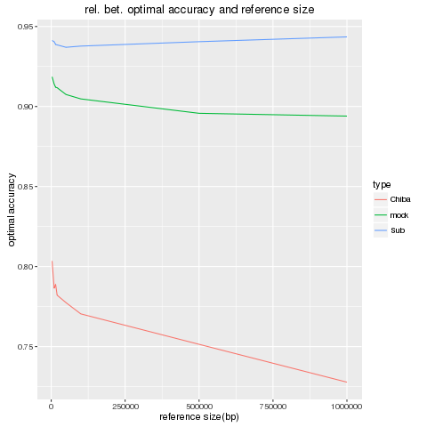

# 2017-10-14

## Aim

+ k-NNを用いたSquiggleのReference in/not predictorの作成

## What for

+ 簡単k-NNがどこまでできるかのベンチマークを作りたい。

## Method

+ 実際のsquiggleが入っているかどうかをsquiggleのみから学習するのは、直感的には難しそうだし、Time consumingな気がする（Normalizeを掛けないといけないし、自明な特徴量は無いし、k-NNが自動的にそういう特徴量を抽出してくれる気配もない）ので、リファレンスに対して、アラインメントしたスコアを特徴量に用いることにする。

+ 用いるメソッドは、前回上手く行ったChibaNormalFlat 1000とSubHillNormal450にする。以前の研究で使われていたSubNormalNormal250も用いる。リファレンスサイズは5K,10K,50K,100K,1Mと動かす。
+ クロスバリデーションも取る。
+ 具体的には、まず、次のようなデータセットを作る(ChibaNormalFlat/SubHillNormalに対して)

reference size | score | type
---------------|-------|------
      5        |  40   |  1
      10       |  23.4 |  -1

ここで、リファレンスサイズはK単位。typeは1が『リファレンスにその配列が含まれているとき』、-1が『リファレンスにその配列を含まない時』だとする。
+ 速さがほしいので、Rustでかく.

## Assumed Result

+ 特徴量を一次元に落とすのは流石にやりすぎだが……。
+ 実際のところは、データセットを作成するところ＋k-NNのkを確定させるところまでで終わり。
+ 今、False、Trueともに同じサイズのデータセットがあることに注意。馬鹿みたいにkを大きくしても嬉しいことは起こらない。

## Data

+ 面倒くさいが、もう一度データセットを作成した。
+ queries.dat は、bwa memで0のフラグが立った（テンプレート鎖にアラインされた）リードを2000個、場所とカンマ区切りで書いてある。
+ 方法は前回とほぼ同様だが、Optimal scoreをCorrect な部分を含む場合と含まない場合で分けて、データセットを作った。

## Result

+ Test dataset でやった場合は、正答率が7～8割だったので、一応リークはしていないようだ
+ 結果はだいたい8割くらいのaccuracyがoptimalか。
+ トレーニングデータセットの大きさをT,用いる近傍の個数をKとすると、一つのクエリあたりの計算量は(logT+K)なので、だいたいこれが均衡するようなkを選ぶのが良さそうだが……
+ とりあえず、k=15で決め打ちする。

これはChiba-Sakoe bandを用いた場合の性能。大体7.2～8.0割程度の正答率。低い……。特に、reference size を大きくするほど正答率が下がるのは致命的だ。リファレンスを1Mまで大きくすると、正答率は7.2割にまで落ち込んでしまう。下がり幅はそれほど大きくないが……

SubDTWを用いて、Hill functionを距離関数の代わりに用いた場合の結果。リファレンスサイズを大きくしても、正答率は9.4割をキープしている。とても不思議な気がする。特徴量抽出としてDTWが良いのかもしれない。

SubDTWを用いて、通常の二乗距離を用いた場合の結果。正答率は僅かに落ち続けている。

以上をまとめたものが、以下の画像

